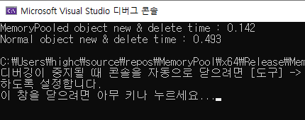

## Introduce MemoryPool
#### 소개
- STL vector를 사용한 고정 메모리 풀의 구현.
 

## 구현
- [x] 2개의 vector로 별도의 pool과 block 구현.
https://github.com/StdDongcheol/Prac_MemPool/blob/8cfcb7900bb1a70be65407184927ed7842a1bd55/MemoryPool/CMemoryPool.h#L6-L20
 
  
- [x] allocate함수와 deallocate 함수 구현.
https://github.com/StdDongcheol/Prac_MemPool/blob/8cfcb7900bb1a70be65407184927ed7842a1bd55/MemoryPool/CMemoryPool.cpp#L26-L51  
  
  
- [x] 별도의 매크로를 정의하여 new, delete 연산자를 구현.
https://github.com/StdDongcheol/Prac_MemPool/blob/8cfcb7900bb1a70be65407184927ed7842a1bd55/MemoryPool/MemoryPoolMgr.h#L4-L22  
  

- [x] 메모리 풀을 적용할 클래스에 매크로 선언.
https://github.com/StdDongcheol/Prac_MemPool/blob/8cfcb7900bb1a70be65407184927ed7842a1bd55/MemoryPool/CObject.h#L7-L20  
 

## 결과
* 고정 메모리 풀이 적용된 오브젝트 클래스와 적용되지 않은 일반 오브젝트 클래스의 new, delete 수행 시간을 비교.
* 각 클래스는 10,000,000회씩 new, delete 연산을 수행.
  

* 고정 메모리 풀이 적용된 오브젝트 클래스
  * 10,000,000회 new, delete 수행시간 : 142ms 경과
https://github.com/StdDongcheol/Prac_MemPool/blob/8cfcb7900bb1a70be65407184927ed7842a1bd55/MemoryPool/main.cpp#L13-L28

* 일반 오브젝트 클래스
  * 10,000,000회 new, delete 수행시간 : 493ms 경과
https://github.com/StdDongcheol/Prac_MemPool/blob/8cfcb7900bb1a70be65407184927ed7842a1bd55/MemoryPool/main.cpp#L32-L47
 

* 실행결과 사진

 

